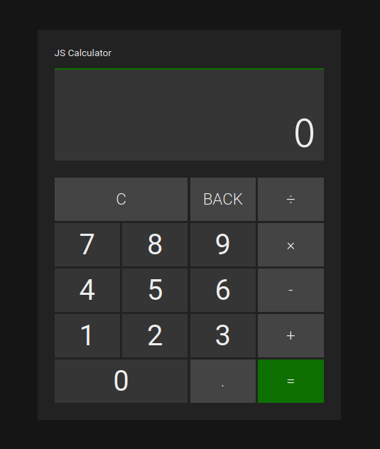

# JavaScript Calculator

 

## Table of contents

- [Live preview](#live-preview)
- [Screenshots](#screenshots)
- [Technologies](#technologies)
- [Features](#features)
- [Credits](#credits)
- [Contact](#contact)

## Live preview

https://alejandrovela-dev.github.io/js-calculator/

## Screenshots

## Technologies

- HTML5
- CSS3
- JavaScript ES6

## Features

- Basic math operations (addition, subtraction, multiplication and division)
- Floating point numbers support
- Backspace button
- Responsive design
- Keyboard support

## Credits

This project is an assignment from [TheOdinProject](https://www.theodinproject.com). Design was inspired by [Windows Calculator app](https://github.com/Microsoft/calculator).

## Contact

Created by [@AlejandroVela](https://github.com/AlejandroVela-Dev) - feel free to contact me!
